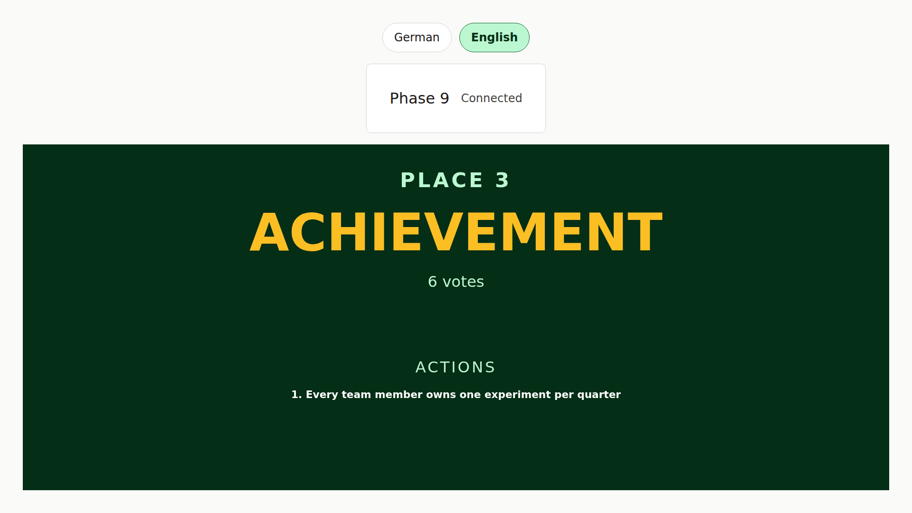
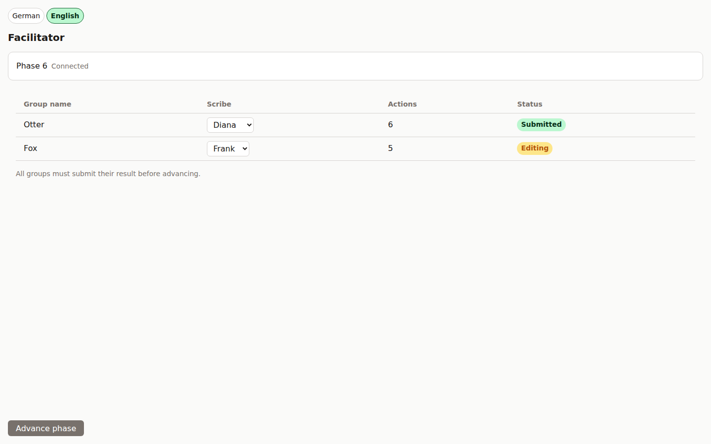
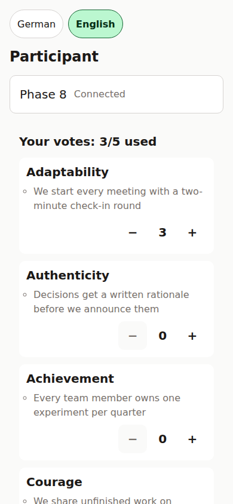
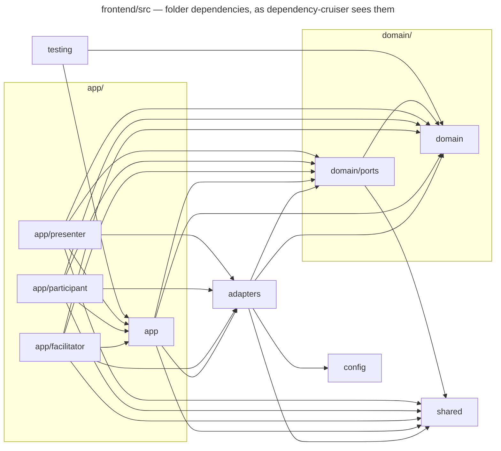
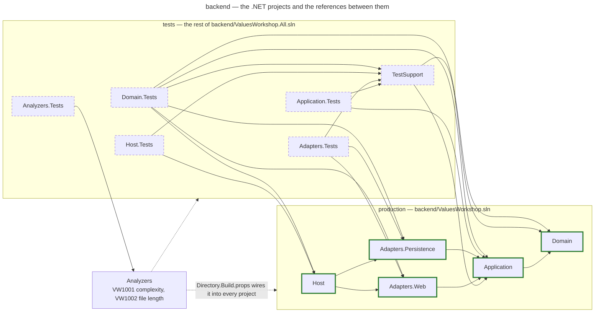
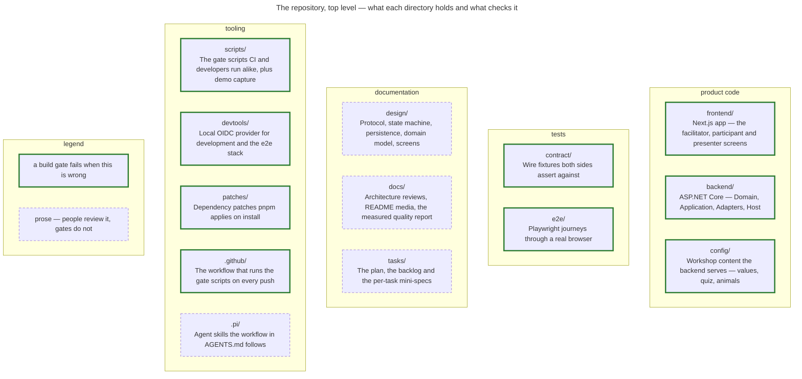

# ValuesWorkshop

[](https://github.com/JakobKrummeich/ValuesWorkshop/actions/workflows/ci.yml)
[](docs/quality/metrics.md)
[](docs/quality/metrics.md)
[](docs/quality/metrics.md)
[](docs/quality/metrics.md)

A real-time platform for a facilitated two-hour workshop in which a team
(up to ~30 people) works out its shared values and — the part that matters —
pragmatic everyday **actions** for each of them. Participants take part on
their phones, a projector wall shows live visualisations, and the facilitator
steers the nine phases from a laptop. Every result is persisted; a server
restart mid-workshop loses nothing. The workshop ends with a downloadable,
anonymous PDF record. See `SPEC.md` for the product spec.


The animation is the whole 77-second demo film at 12 frames per second.
The full-resolution recording is [`docs/media/demo.mp4`](docs/media/demo.mp4)
— 1920×1080, 30 fps, silent. GitHub does not play a repository-hosted MP4
inline, so that link downloads the file.

| Phase | What happens |
|---|---|
| 1 Join | Participants scan the QR code on the wall and sign in |
| 2 Quiz | Warm-up quiz with live answer tallies |
| 3 Value selection | Everyone picks their most important values |
| 4 Selection results | Bar chart of the most-selected values |
| 5 Group formation | Participants are dealt into random groups, each named after an animal |
| 6 Group work | Each group writes concrete actions for its values |
| 7 Value presentation | Groups present their actions to the room |
| 8 Final voting | Everyone votes on the values with actions; tiebreak rounds if needed |
| 9 Final presentation | Winners revealed one by one; PDF record download |

## Screenshots

| Presenter wall — winner reveal | Facilitator — group work | Participant — final vote |
|---|---|---|
|  |  |  |

The screenshots come out of `pnpm demo:media`: a Playwright script
(`scripts/demoMedia/`) that drives an eight-person workshop against the
running dev compose stack and saves the three images into `docs/media/`. It
needs `pnpm install` at the repository root plus `pnpm exec playwright
install chromium`, and it leaves that workshop behind in the `vw-data`
volume.

`pnpm demo:video` (`scripts/demoVideo/`) drives the same eight-person
workshop and turns it into the film above, in four steps: Playwright records
the wall, the laptop and one phone while noting when each scene starts, ffmpeg
splits the recordings into frames, Playwright composes every film frame on an
HTML stage that puts the phone and the laptop into device frames and adds the
caption, and ffmpeg encodes the MP4 and the GIF into `docs/media/`. It needs
the same setup as `pnpm demo:media` plus Docker, which is where ffmpeg comes
from — nothing is installed on the host. The run takes around ten minutes and
keeps its intermediate frames in `/tmp/valuesWorkshopDemoVideo`. Neither
script runs in CI; both are local, on purpose.

## Engineering

The workshop is the product; how it is built is the other half of what this
repository claims. Both sides are hexagonal — ports in the domain, adapters
outside it, screens wired through per-role DI contexts — and the layering is
machine-checked, by dependency-cruiser on the frontend and ArchUnitNET on the
backend. The wire contract between them cannot drift, because both sides
assert against the same checked-in fixtures. A function above cyclomatic
complexity 7, a production file beyond 300 lines or duplication beyond 2 %
fails the build; the tests are mutation-tested nightly, and every screen
passes an axe-core accessibility gate inside the end-to-end suite.

Every number and diagram in this section is written by `pnpm quality:report`
from the tools' own output, stamped with the commit it describes — nothing
here is typed by hand.

<!-- quality:headline:start -->

| What | Frontend | Backend | Enforced by |
| --- | ---: | ---: | --- |
| Production code | 15,874 lines | 8,876 lines | — |
| Test code | 16,934 lines | 19,807 lines | — |
| Tests | 1,356 jest | 950 xunit | `scripts/ci-test.sh` on every push, plus 93 Playwright journeys through a real browser |
| Line coverage | 92.46% (at least 80%) | 98.6% (at least 80%) | `jest --coverage` / coverlet |
| Mutation score | 86.43% | 84.59% | Stryker, nightly and on demand |
| Cyclomatic complexity | highest 7 (at most 7) | highest 7 (at most 7) | eslint `complexity` / analyzer VW1001 |
| Longest production file | 290 lines (at most 300) | 262 lines (at most 300) | eslint `max-lines` / analyzer VW1002 |
| Duplicated tokens | 0.13% (at most 2%) | 0.13% (at most 2%) | `jscpd`, one scan over both sides |
| Architecture violations | 0 across 14 dependency-cruiser rules | 0 across 8 ArchUnitNET rules | dependency-cruiser fails the lint, ArchUnitNET fails the tests |
| Known advisories | 0 | 0 | `pnpm audit` / `dotnet list package --vulnerable`; osv-scanner over the lockfile and both SBOMs finds 0 |

<!-- quality:headline:end -->

### Frontend modules

The folder-level dependency graph of `frontend/src`, folded from
dependency-cruiser's module report. The rules in
`frontend/.dependency-cruiser.cjs` fail the lint on any forbidden edge, so the
picture shows what the gate allows and nothing else.

<!-- quality:diagram:frontend-modules:start -->



<!-- quality:diagram:frontend-modules:end -->

### Backend layers

The .NET projects and the references between them, parsed from the `.csproj`
files. ArchUnitNET tests fail on a reference that points the wrong way.

<!-- quality:diagram:backend-layers:start -->



<!-- quality:diagram:backend-layers:end -->

### Repository map

What each top-level directory holds and which ones a build gate reads, from
`git ls-files`; a directory git tracks that the map does not describe fails
the generator.

<!-- quality:diagram:repo-structure:start -->



<!-- quality:diagram:repo-structure:end -->

### Hotspots

The ten files where change and complexity overlap most — the ones most likely
to hold the next bug. Churn is the number of commits that touched a file over
the whole history, from `git log --numstat`; complexity is cyclomatic, from
the same tools that enforce the cap — eslint's `complexity` rule on the
frontend, the VW1001 analyzer on the backend — summed over a file's functions;
the score is the product of the two.

<!-- quality:hotspots:start -->

| file | side | commits | lines changed | complexity | score |
| --- | --- | ---: | ---: | ---: | ---: |
| `backend/Domain/Session.cs` | backend | 24 | 486 | 32 | 768 |
| `backend/Domain/VotingRounds.cs` | backend | 8 | 264 | 48 | 384 |
| `backend/Domain/Group.cs` | backend | 11 | 257 | 30 | 330 |
| `frontend/src/app/participant/phases/groupWork/useGroupWorkCard.ts` | frontend | 12 | 471 | 27 | 324 |
| `backend/Domain/QuizProgress.cs` | backend | 11 | 199 | 25 | 275 |
| `backend/Adapters.Persistence/SqliteSessionRepository.cs` | backend | 11 | 348 | 23 | 253 |
| `backend/Adapters.Web/ParticipantHub.cs` | backend | 18 | 235 | 12 | 216 |
| `backend/Application/Intents/FacilitatorIntentHandler.cs` | backend | 16 | 271 | 13 | 208 |
| `frontend/src/adapters/authAdapter.ts` | frontend | 9 | 272 | 22 | 198 |
| `backend/Adapters.Web/FacilitatorHub.cs` | backend | 12 | 184 | 16 | 192 |

<!-- quality:hotspots:end -->

The full table, with every command that produced a number, is
[`docs/quality/metrics.md`](docs/quality/metrics.md). The database schema — an
`erDiagram` emitted from the EF Core model itself — is
[`docs/quality/database.mmd`](docs/quality/database.mmd), the last mutation
run is [`docs/quality/mutation.json`](docs/quality/mutation.json), and the
CycloneDX bills of materials are in [`docs/quality/sbom/`](docs/quality/sbom/).
The four structural diagrams are drift-gated: a test regenerates each one and
fails when the checked-in file differs — and, for the three shown here, when
this README's copy differs. `pnpm quality:report` regenerates all of it.

## Run the demo

Prerequisites: Docker with the Compose plugin (`docker compose version`).
Nothing else — the stack builds and runs the frontend, backend, and a local
OIDC provider with 31 test accounts.

```sh
git clone https://github.com/JakobKrummeich/ValuesWorkshop.git
cd ValuesWorkshop
docker compose -f docker-compose.dev.yml up --build
```

Wait until `docker compose -f docker-compose.dev.yml ps` lists the backend as
`healthy`, then open the three roles in a browser (all local accounts accept
any password):

1. **Facilitator** — http://localhost:3000/facilitator. Sign in as
   `facilitator`, enter a session name and the passphrase
   `dev-facilitator-passphrase`, open the session. The address bar now
   carries `?sessionIdentity=<id>`; the same identity addresses the other
   two roles.
2. **Presenter wall** — `http://localhost:3000/presenter?sessionIdentity=<id>`
   in a second window, ideally fullscreen. It shows the join QR code and
   later the live visualisations; it never needs a sign-in.
3. **Participants** — the wall's QR code or the facilitator's "Copy join
   link" button lead to `http://localhost:3000/participant?sessionIdentity=<id>`.
   Sign in as `participant1` … `participant30` (Alice, Bob, Charlie, …), one
   account per browser profile or private window. Four to eight participants
   make a good demo; one is enough to walk through every phase.

The facilitator advances the phases; participants and the wall follow in
real time. Stop with `Ctrl+C`; `docker compose -f docker-compose.dev.yml down -v`
also drops the database volume so the next run starts clean.

## Layout

| Path | What |
|---|---|
| `frontend/` | Next.js app — `src/{domain,adapters,app}`; screen groups `app/{facilitator,participant,presenter}/`, each with its own DI context |
| `backend/` | ASP.NET Core — `Domain` ← `Application` ← `Adapters.Persistence` / `Adapters.Web` ← `Host` (hexagonal; ports in `Domain`) |
| `e2e/` | Playwright end-to-end tests |
| `contract/` | Machine-checked FE/BE wire contract — intents, enums and per-phase state samples; see `contract/README.md` |
| `config/` | Workshop content: `values.json`, `quiz.json`, `animals.json` (all texts `de` + `en`) |
| `devtools/oidc/` | Local OIDC provider for development (`node devtools/oidc`) |
| `design/` | Architecture, domain model, persistence, protocol, state machine, screens, visual system |
| `docs/` | Architecture reviews (ADR-style proposals); `docs/media/` holds the README screenshots and the demo film; `docs/quality/` holds the measured-quality report |
| `scripts/` | CI gate scripts, the `demoMedia/` screenshot capture (`pnpm demo:media`) and the `demoVideo/` film pipeline (`pnpm demo:video`), both sharing the workshop drive in `demoWorkshop/` |
| `tasks/` | Plan, backlog, per-task mini-specs |

## Commands

```sh
pnpm --dir frontend dev|test|lint          # frontend
dotnet build backend/ValuesWorkshop.sln    # backend (prod + analyzers, no test projects)
dotnet test backend/ValuesWorkshop.Tests.slnf
node devtools/oidc                         # OIDC discovery on :9000
docker compose -f docker-compose.dev.yml up  # all services (backend :5000, frontend :3000, oidc :9000)
scripts/verify-startup.sh                  # native start + health check gate
scripts/ci-lint.sh                         # all lint gates
scripts/ci-test.sh                         # all test gates, e2e included
scripts/ci-e2e.sh                          # compose stack + Playwright, standalone
pnpm quality:report                        # regenerate docs/quality/ and the README's Engineering section
```

## End-to-end tests

Playwright drives real browsers against the compose stack. The config has no
`webServer` block, so bring the stack up first — or run `scripts/ci-e2e.sh`,
which brings the stack up, runs the suite and tears the stack down again. CI
runs that same script in its own `e2e` job.

The suite runs the stack with `docker-compose.e2e.yml` layered on top of the
dev file: it widens the session-creation rate limit and stretches the group
formation window, both of which the suite asserts against. The dev stack alone
runs the production values.

The suite asserts on visible text, so `playwright.config.ts` pins the browser
locale to English; the app otherwise follows the browser's `Accept-Language`.

```sh
compose="-f docker-compose.dev.yml -f docker-compose.e2e.yml"
docker compose $compose up -d --build   # wait for backend healthy
npx playwright test                     # whole suite
npx playwright test sessionLifecycle    # one spec
docker compose $compose down            # add -v to drop the database volume
```

The session lifecycle and restart recovery suites restart the backend
container mid-suite, so Playwright runs with one worker; `retries` stays `0`.

Two things bite when the stack is stale: the frontend image inlines the
`NEXT_PUBLIC_*` values at build time (compose passes them as build args), so
changing them needs `up -d --build`. The database is not one of them: EF Core
migrations run at startup and evolve an existing volume in place.

## Backend configuration

| Variable | Required | Dev value |
|---|---|---|
| `FACILITATOR_PASSPHRASE` | yes — the host refuses to start without it | `dev-facilitator-passphrase` |
| `CONFIG_DIR` | no (`config`) | `/config` in compose (mounted from `./config`) |
| `DATA_DIR` | no (`data`) | `/data` in compose |
| `OIDC_AUTHORITY` / `OIDC_METADATA_URL` | no | `http://localhost:9000` |
| `CORS_ORIGINS` | no | `http://localhost:3000` |
| `STATE_RESEND_INTERVAL_MS` | no (`500`) | `500` |
| `GROUP_FORMATION_WINDOW_MS` | no (`3000`) | `3000` (`10000` under `docker-compose.e2e.yml`) |
| `GROUP_FORMATION_TICK_INTERVAL_MS` | no (`50`) | `50` |
| `GROUP_FORMATION_DISCOVERY_INTERVAL_MS` | no (`250`) | `250` |
| `SESSION_CREATION_ATTEMPTS_PER_WINDOW` | no (`5`) | `5` (`30` under `docker-compose.e2e.yml`) |
| `SESSION_CREATION_ATTEMPT_WINDOW_SECONDS` | no (`60`) | `60` |

The dev passphrase is a local development value only; a real deployment sets
its own secret through the environment. Session creation is rate limited per
caller (the token `sub`, or the remote IP address when there is none):
attempts beyond the window get `429` without the passphrase being compared.

Layer mapping FE ↔ BE and architecture rules: `design/architecture.md`.
