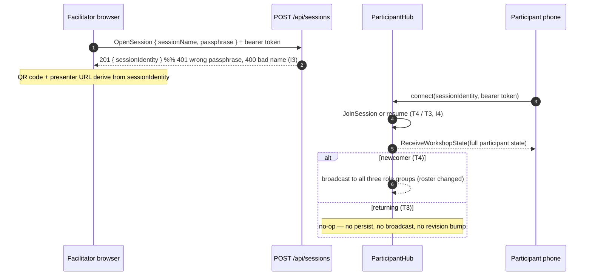
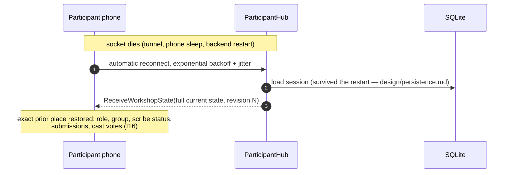
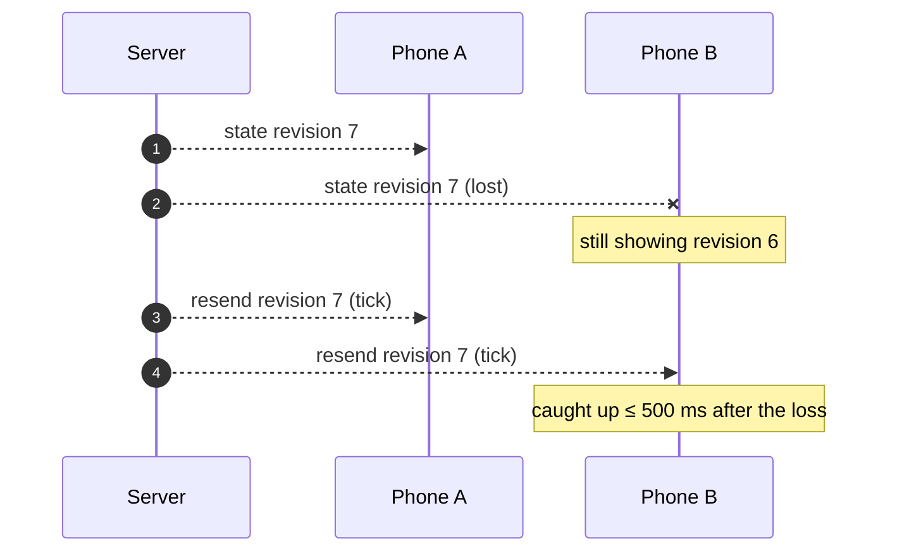
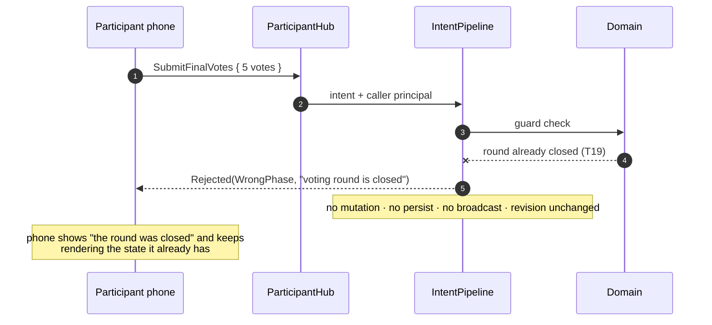
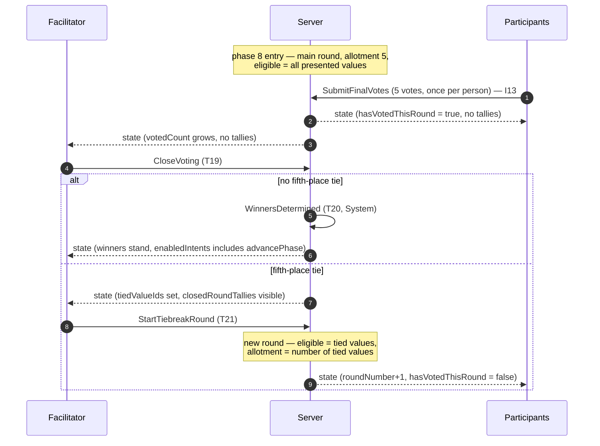

# Protocol — ValuesWorkshop

Living document. The FE/BE contract for real-time communication. Deviations
discovered during implementation update this file in the same PR (Ask-first).

Vocabulary is the ubiquitous language of `design/domain-model.md`; every
transition referenced as `T*` is defined in `design/state-machine.md`.

---

## 1. Principles

1. **Server-authoritative.** Clients send *intents*. The server validates
   every intent against role, phase, and domain invariants, then mutates,
   persists, and broadcasts. A client never computes authoritative results
   and never enables a control from locally derived guard logic (§ 6.4).
2. **Full state, never deltas.** Every server→client message carries the
   complete state that role is allowed to see. There is no incremental
   update, no client-side merging, no ordering problem.
3. **Immediate state on connect.** A connection is pushed the full current
   state in `OnConnectedAsync`, before any broadcast can reach it. Reconnect
   is the same code path, so a returning client never waits for the next
   mutation (T3, I16).
4. **Self-healing sync.** The latest state is resent to every role group
   every 500 ms. A dropped message therefore corrects itself within one
   interval. A monotonic `revision` makes redundant resends free (§ 3.4).
5. **One hub per role.** A client can only receive the state shape of the
   hub it is connected to, so no role can be sent data it must not see
   (§ 5.5) — anonymity by construction, not by client-side filtering.
6. **Session binding at the edge.** `sessionIdentity` travels only in the
   connection's query string and lives only in the FE dependency context
   that constructs the adapters. It appears in no port signature, no UI
   prop, and no domain type (SPEC.md “Session binding at the edge”).
7. **Content is not state.** The wire carries identifiers (`valueId`,
   `questionId`, `answerId`, `animalId`); the localized texts live in
   `config/*.json`, are loaded by the frontend, and are resolved there
   (de/en). Group names are animal identifiers from `config/animals.json` and
   are localized the same way. The single exception is participant-written
   action text, which is free text and travels verbatim.

---

## 2. Endpoints

| Endpoint | Kind | Auth | Purpose |
|---|---|---|---|
| `POST /api/sessions` | HTTP | Bearer + facilitator passphrase in body | Open a session (T1) and receive its `sessionIdentity` (§ 2.1) |
| `/hub/facilitator?sessionIdentity=…` | SignalR | Bearer (facilitator) | Facilitator intents + facilitator state |
| `/hub/participant?sessionIdentity=…` | SignalR | Bearer (participant) | Participant intents + participant state |
| `/hub/presenter?sessionIdentity=…` | SignalR | anonymous | Presenter state only, no intents |

### 2.1 `POST /api/sessions`

Bearer-authenticated: the token supplies the facilitator `sub`, the body
supplies the shared facilitator passphrase (`FACILITATOR_PASSPHRASE`, set on
the server; the host refuses to start without it).

```http
POST /api/sessions
Authorization: Bearer <OIDC access token>
Content-Type: application/json

{ "sessionName": "Acme values workshop", "passphrase": "…" }
```

| Status | Body | When |
|---|---|---|
| `201 Created` | `{ "sessionIdentity": "<guid>" }` | passphrase matched and the name is valid; the session is persisted at `revision = 0` with the caller's `sub` as its facilitator |
| `400 Bad Request` | problem detail “The session name is missing, blank, or too long.” | passphrase matched, name missing, blank, or over 120 characters |
| `401 Unauthorized` | empty | no bearer token, no `sub` claim, or a wrong, absent, or empty passphrase |
| `429 Too Many Requests` | empty | the caller exceeded `SESSION_CREATION_ATTEMPTS_PER_WINDOW` attempts inside `SESSION_CREATION_ATTEMPT_WINDOW_SECONDS` |

The rate limit is a fixed window partitioned by caller — the token `sub` when
there is one, otherwise the remote IP address — so one attacker guessing
passphrases cannot lock out every other facilitator. It defaults to 5 attempts
per 60 seconds and is refused before the passphrase is compared.

The passphrase is compared with `CryptographicOperations.FixedTimeEquals`
over SHA-256 digests of the UTF-8 bytes, **before** the name is validated: a wrong passphrase always
yields `401`, never a `400` that would confirm the passphrase was right. No
response echoes the passphrase, and a rejected request writes nothing.

The returned `sessionIdentity` is the only thing the client keeps — the
passphrase lives in component state until submit and is never stored.

**Bearer** is the OIDC JWT access token of Task 8 (`oidc-client-ts` in the
browser, handed to SignalR through `accessTokenFactory`, silently renewed
before expiry). Its `sub` claim is the stable person identity: it is what the
roster stores, so a reconnecting phone resumes its existing place instead of
becoming a second participant (T3, I4). The token proves *who* the person is,
never *what role* they hold — role is session state, not a token claim:
the facilitator is the `sub` recorded when `POST /api/sessions` accepted the
facilitator passphrase (I3).

The facilitator hub enforces that at **connect** time:
`OnConnectedAsync` loads the session and, unless the caller's `sub` is the
recorded facilitator, aborts the connection with a `HubException` before the
caller joins any group or is sent any state. A refused caller therefore never
receives facilitator state and has no connection to invoke an intent on — the
refusal is a failed connection, not an `IntentResult`, so no rejection code
travels for it (§ 6.2 applies to intents only). Intents that mutate the
session also verify the actor (I2) in the domain, so the per-intent
`NotAuthorized` rejection exists as defense-in-depth. The frontend shows such a
connection as `disconnected`; SignalR's automatic reconnect covers dropped
connections, not a start that was refused. An unknown `sessionIdentity` fails
the same way, on every hub.

The facilitator needs nothing in client storage to come back: the URL carries
`sessionIdentity` and the token carries the `sub`, so reopening the tab
restores control without re-entering the passphrase.

`OpenSession` (T1) is the one intent that is **not** a hub method: no session
exists yet, so there is nothing to bind a session-bound connection to. It is
an HTTP request that returns the identity the three hubs are then bound to.

Groups: `facilitator:{sessionIdentity}`, `presenter:{sessionIdentity}`, and
`participant:{sessionIdentity}:{participantId}` — added in `OnConnectedAsync`,
removed automatically on disconnect. The participant group is per person, not
per session, because participant state is caller-shaped: it carries the
caller's own answer, own selection, and own group standing (§ 5.2). One group
per participant keeps “each client can only be sent its own state” a property
of the addressing itself; a participant's phone and tablet share that group,
so both stay in sync.

The `participantId` is derived from the token's `sub` claim and the session
(SHA-256 over `valuesworkshop:participant:{sessionIdentity}:{sub}`), never
taken from a payload — the same person is the same participant on every device
and after every reconnect (I4), while the same person attending two workshops
is two unrelated participants, one per session (`design/persistence.md`:
`participants.id` is globally unique, and a participant belongs to exactly one
session).

The display name comes from the token's `name` claim, read at connect time and
never from a payload — nobody can name themselves something they are not.
Azure AD puts `name` on the access token of a user; the dev provider does the
same through `extraTokenClaims`. A missing or blank claim falls back to a
deterministic `#`-prefixed label derived from the `participantId`, so a token
without a profile still joins.

On the participant hub, `OnConnectedAsync` runs the join intent through the
pipeline and then pushes the current state to the caller directly — the same
pattern the facilitator and presenter hubs use. For a newcomer (T4) the join
mutates the roster, bumps `revision`, persists, and broadcasts to all three
role groups. For a returning participant (T3) the join is a no-op: no
mutation, no persist, no revision bump, no broadcast — the direct caller push
is the only message sent. An unknown `sessionIdentity` closes the connection
with that reason instead of pushing state.
Browsers cannot set headers on a WebSocket handshake, so SignalR passes the
bearer token as the `access_token` query parameter on `/hub/*`.

---

## 3. Connection lifecycle

### 3.1 Connect



Joining is **implicit on connect** (`design/screens.md`: “JoinSession fires
implicitly on arrival; no form, no button”):

- not on the roster → join (T4), in **any** phase
- already on the roster → resume (T3)

Late joining is allowed on purpose: someone who arrives in phase 6 still
belongs in the room. A joiner takes part in everything still ahead of them
and contributes nothing to what was already computed — the selection tally
is fixed on entry to phase 4 (I7) and the value-to-group assignment on entry
to phase 5 (I8). From phase 5 on, joining also places the newcomer in the
group with the fewest members (ties random, `ParticipantAddedToGroup`), so
group sizes still differ by at most one; the newcomer is never that group's
scribe, and a group that already submitted stays submitted.

### 3.2 Reconnect and backend restart



No client-side resync request exists. Reconnect == connect.

### 3.3 Periodic resend

One hosted service ticks every `STATE_RESEND_INTERVAL_MS` (default **500**).
Per session with at least one connected client, it resends the latest state to
each of the three role groups. Between mutations this is pure serialization:
the three mapped role states are cached and re-mapped only when `revision`
changes; no repository read, no domain work, no SQLite traffic.



### 3.4 `revision`

Every state record carries `revision`: a monotonic counter on the session,
incremented once per persisted mutation. Client rule: **apply the state only
if `revision` is greater than the last applied revision**; otherwise drop it.
Consequences: unchanged resends cause no re-render and no flicker, and a late
or duplicated message can never move a screen backwards.

---

## 4. Intent catalog

Payload types are C# records on the server and Zod schemas on the client
(§ 6.3). `ParticipantId` is never taken from a payload — it is derived from
the caller's authenticated principal, so no client can act as another.

### 4.1 Facilitator hub

| # | Method | Payload | Guard (server-checked) | Rejection |
|---|---|---|---|---|
| T2 | `AdvancePhase` | — | facilitator (I2); forward only (I1); phase-exit guards T2a–T2c | `WrongPhase`, `NotAuthorized` |
| T6 | `RevealAnswer` | — | phase Quiz; current question unrevealed | `WrongPhase` |
| T7 | `ShowLearningText` | — | phase Quiz; answer revealed, text unshown | `WrongPhase` |
| T8 | `PoseNextQuestion` | — | phase Quiz; learning text shown; questions remain | `WrongPhase` |
| T13 | `ReassignScribe` | `{ groupName, participantId }` | phase Group work; target is a member of that group (I9) | `WrongPhase`, `InvariantViolated`, `UnknownParticipant` |
| T17 | `GoToNextValue` | — | phase Value presentation; values remain (I12) | `WrongPhase` |
| T17a | `CorrectActionWording` | `{ actionId, text }` | phase Value presentation; action belongs to the presented value; text non-empty ≤ 500 chars (I10) | `WrongPhase`, `InvariantViolated`, `MalformedPayload` |
| T19 | `CloseVoting` | — | phase Final voting; round open | `WrongPhase` |
| T21 | `StartTiebreakRound` | — | phase Final voting; last closed round left a fifth-place tie (I15) | `WrongPhase`, `InvariantViolated` |
| T22 | `RevealNextValue` | — | phase Final presentation; winners remain | `WrongPhase` |

### 4.2 Participant hub

| # | Method | Payload | Guard (server-checked) | Rejection |
|---|---|---|---|---|
| T4/T3 | *(implicit on connect)* | — | see § 3.1 | — |
| T5 | `ChooseQuizAnswer` | `{ questionId, answerId }` | phase Quiz; `questionId` is the posed question; answer belongs to it; not yet answered (I5) | `WrongPhase`, `MalformedPayload`, `InvariantViolated` |
| T9 | `SubmitValueSelection` | `{ valueIds }` | phase Value selection; exactly ten distinct catalog values; not yet submitted (I6) | `WrongPhase`, `MalformedPayload`, `InvariantViolated` |
| T14 | `AddAction` | `{ valueId, text }` | phase Group work; caller is scribe of their group (I10); group Editing; value assigned to that group; ≤ five actions on it (I11); text non-empty ≤ 500 chars | `WrongPhase`, `NotAuthorized`, `InvariantViolated`, `MalformedPayload` |
| T14 | `EditAction` | `{ actionId, text }` | as `AddAction`; action belongs to the caller's group | `WrongPhase`, `NotAuthorized`, `InvariantViolated`, `MalformedPayload` |
| T14 | `RemoveAction` | `{ actionId }` | as `EditAction` | `WrongPhase`, `NotAuthorized`, `InvariantViolated` |
| T15 | `SubmitGroupWork` | — | phase Group work; caller is scribe; one to five actions on every assigned value (I11) | `WrongPhase`, `NotAuthorized`, `InvariantViolated` |
| T16 | `ReopenGroupWork` | — | phase Group work; caller is scribe; group Submitted | `WrongPhase`, `NotAuthorized` |
| T18 | `SubmitFinalVotes` | `{ votes: [{ valueId, voteCount }] }` | phase Final voting; round open; totals equal the round allotment; only eligible values; not yet voted this round (I13) | `WrongPhase`, `MalformedPayload`, `InvariantViolated` |

`SubmitFinalVotes` is irrevocable (I14): the server records *that* the caller
voted and adds the counts to anonymous tallies. No un-vote intent exists.

### 4.3 Presenter hub

No intents. The hub exposes no mutating method at all, so an unauthenticated
presenter connection has nothing to call (Decision 5).

### 4.4 System transitions

T4a `AddParticipantToGroup`, T10 `DetermineTopValues`, T11 `FormGroups`,
T12 `AppointScribes`, T20
`WinnersDetermined`, T23 `WorkshopConcluded` have **no wire representation**.
They fire inside the server as part of the transition that triggers them
(phase entry, or voting close) and are visible only as changed state. This is
deliberate: nothing a client sends can influence them.

### 4.5 Coverage check

T1 → § 2 (HTTP) · T2, T2a–T2c, T6, T7, T8, T13, T17, T17a, T19, T21, T22 →
§ 4.1 · T3, T4 → § 3.1 · T5, T9, T14, T15, T16, T18 → § 4.2 · T4a, T10, T11,
T12, T20, T23 → § 4.4. All 28 transitions of `design/state-machine.md` § 3
are accounted for.

---

## 5. Server→client state

One client callback per hub, always the same shape for that role:
`ReceiveWorkshopState(<Role>WorkshopState)`.

### 5.1 Envelope and phase variants

Each role state is a **phase-discriminated union**: one record per phase,
named `<Role><Phase>State`, tagged by the `phase` discriminator
(`[JsonPolymorphic(TypeDiscriminatorPropertyName = "phase")]` on the server,
`z.discriminatedUnion("phase", …)` on the client). A state carries exactly
the blocks its phase needs. A block that belongs to another phase is not sent
as `null` — it is not part of that variant at all, so a screen can never read
a block that its phase does not define.

| Field | Type | Meaning |
|---|---|---|
| `revision` | long | monotonic, see § 3.4 |
| `phase` | 1–9 | discriminator, selects the variant (I1) |

Every variant of a role also carries that role's constant block: `roster` for
the facilitator, `participantCount` for participant and presenter.

| Phase | Participant blocks | Facilitator blocks | Presenter blocks |
|---|---|---|---|
| 1 Join | — | — | — |
| 2 Quiz | `quiz` | `quiz` | `quiz` |
| 3 ValueSelection | `selection` | `selection` | `selection` |
| 4 SelectionResults | `selection` | `selection` | `selection` |
| 5 GroupFormation | `ownGroup?` | `selection`, `groups` | `selection`, `groups` |
| 6 GroupWork | `ownGroup?` | `groups` | `groups` |
| 7 ValuePresentation | `ownGroup?`, `presentation` | `groups`, `presentation` | `groups`, `presentation` |
| 8 FinalVoting | `voting` | `voting` | `voting` |
| 9 FinalPresentation | `conclusion` | `conclusion` | `conclusion` |

`ownGroup?` is the one genuinely optional block: a participant who has not
been placed in a group yet has none. `groups` is a list and is empty until
the formation has run — never null.

§§ 5.2–5.4 give the shape of each block; the matrix above says which
variant carries it.

### 5.2 `ParticipantWorkshopState`

| Block | Fields |
|---|---|
| quiz | `questionId`, `subState` (`answering` \| `revealed` \| `learningTextShown`), `ownAnswerId?`, `correctAnswerId?` (only once revealed) |
| selection | `ownSelectedValueIds`, `isSubmitted`, `selectionTallies?`, `topValueIds?` |
| ownGroup | `name` (animal identifier, localized by the client), `memberNames`, `assignedValueIds`, `isCallerScribe`, `scribeName`, `workStatus` (`editing` \| `submitted`), `actions: [{ actionId, valueId, text, sortOrder }]` |
| presentation | `presentingGroupName`, `presentedValueId`, `presentedActions: [{ actionId, text }]` |
| voting | `roundNumber`, `allotment`, `eligibleValueIds`, `isRoundOpen`, `hasVotedThisRound` |
| conclusion | `revealedWinners: [{ valueId, voteCount, actions }]`, `isConcluded` |

Deliberately absent: any other participant's answer, selection, or votes;
any tally during an open voting round; any participant identifier other than
group member display names.

### 5.3 `FacilitatorWorkshopState`

| Block | Fields |
|---|---|
| roster | `participants: [{ participantId, displayName }]`, `participantCount` |
| quiz | `questionId`, `subState`, `answerTallies`, `answeredCount` |
| selection | `submittedCount`, `selectionTallies`, `topValueIds?` |
| groups | `[{ name, memberParticipantIds, assignedValueIds, scribeParticipantId, actionCountPerValue, workStatus }]` |
| presentation | `presentingGroupName`, `presentedValueId`, `presentedActions: [{ actionId, text }]`, `remainingValueCount` |
| voting | `roundNumber`, `allotment`, `eligibleValueIds`, `isRoundOpen`, `votedCount`, `closedRoundTallies?`, `tiedValueIds?` |
| conclusion | `winners: [{ valueId, voteCount }]`, `revealedCount` |

`enabledIntents: string[]` (§ 6.4) joins the facilitator envelope — it is
present on every variant, because every phase offers controls.

`participantId` appears only for scribe reassignment (T13) and roster
display. It is never paired with an answer, a selection, or a vote.

### 5.4 `PresenterWorkshopState`

| Block | Fields |
|---|---|
| quiz | `questionId`, `subState`, `answerTallies`, `correctAnswerId?` (once revealed) |
| selection | `submittedCount`, `selectionTallies`, `topValueIds?` |
| groups | `[{ name, memberCount, assignedValueIds, workStatus }]` |
| presentation | `presentedValueId`, `presentedActions: [{ text }]` |
| voting | `isRoundOpen` only — no tallies while voting (`design/screens.md`) |
| conclusion | `revealedWinners: [{ valueId, voteCount, actions }]`, `isConcluded` |

Deliberately absent: every participant identifier, every per-person fact, and
all vote tallies before the winners are revealed. Groups are counted, not
named by member.

### 5.5 Anonymity argument

1. The model itself has no voter↔vote link: the session records *that* a
   participant voted and keeps counts per value (I14), and the schema cannot
   express the pairing (`design/persistence.md`: `vote_tallies` has no
   participant column, `voted_participants` has no value column).
2. No role state above contains a participant-to-answer, -selection, or
   -vote mapping. The only per-person facts on the wire are the caller's own
   (`ownAnswerId`, `ownSelectedValueIds`, `hasVotedThisRound`) inside that
   caller's own state.
3. Because each hub can only send its own record type, a facilitator or
   presenter connection cannot be sent a participant's own block even by
   mistake — it is not part of the type it receives.
4. Tests: each mapper is asserted against the full domain state, and a
   reflection test walks every variant of each union and asserts that
   neither `ParticipantWorkshopState` nor `PresenterWorkshopState` carries a
   participant identifier at all, and that `FacilitatorWorkshopState` carries
   one only in the roster and in group membership.

---

## 6. Error model

### 6.1 `IntentResult`

Every hub method returns `IntentResult` to the **caller only**:

- `Accepted`
- `Rejected(IntentRejectionCode code, string detail)`

It is never broadcast, and it carries no state — state always arrives through
`ReceiveWorkshopState`. A rejection is total: no mutation, no persist, no
broadcast, no `revision` bump.

### 6.2 `IntentRejectionCode`

| Code | Meaning |
|---|---|
| `WrongPhase` | the intent does not exist in the current phase or sub-state |
| `NotAuthorized` | right role, wrong standing (e.g. not the scribe, I10) |
| `UnknownSession` | no session with that identity |
| `UnknownParticipant` | referenced participant is not on the roster |
| `InvariantViolated` | a domain invariant refused the mutation (I5–I15) |
| `MalformedPayload` | payload failed structural validation (§ 6.3) |
| `ConcurrencyConflict` | a concurrent writer won the race three times in a row (`design/persistence.md` § 4) |

The set is closed. A new rejection reason is a protocol change and updates
this document.

### 6.3 Payload validation

Server-side, in the pipeline, before any domain call: required fields
present, identifiers non-empty, collections within bounds, free text
non-empty and ≤ 500 characters, no unknown identifiers. Failure →
`MalformedPayload`, nothing else happens.

Client-side, at the adapter boundary: every inbound state is parsed with a
Zod schema before it enters the application. A parse failure is a bug, not a
user-facing state: it is logged and the state is dropped (the next resend
arrives within 500 ms).

### 6.4 `enabledIntents` — no guard logic on the client

The facilitator screen must disable “Advance” exactly when the state machine
would refuse it (T2a–T2c) and morph its quiz sub-control button (T6→T7→T8).
Duplicating those guards in the frontend would mean two implementations of
the same rules. Instead the server evaluates them once and ships the answer:
`enabledIntents` lists the facilitator intents that would be accepted right
now. Buttons render from that list.

### 6.5 Rejection round-trip



---

## 7. Frontend port slices

One slice per concern; each slice is implemented by its own small
session-bound adapter, all sharing one connection per role (Decision 3).
Screens depend only on their slice — never on a connection, never on
`sessionIdentity`.

| Role | Slice | Intents / stream | Task |
|---|---|---|---|
| participant | `sessionStatePort` | state stream + connection state | **9** |
| participant | `quizPort` | `ChooseQuizAnswer` | 12 |
| participant | `selectionPort` | `SubmitValueSelection` | 13 |
| participant | `groupWorkPort` | `AddAction`, `EditAction`, `RemoveAction`, `SubmitGroupWork`, `ReopenGroupWork` | 16 |
| participant | `votingPort` | `SubmitFinalVotes` | 17 |
| facilitator | `sessionStatePort` | state stream + connection state | **9** |
| facilitator | `lifecyclePort` | `AdvancePhase` | **9** |
| facilitator | `quizControlPort` | `RevealAnswer`, `ShowLearningText`, `PoseNextQuestion` | 12 |
| facilitator | `formationPort` | `ReassignScribe` | 16 |
| facilitator | `walkControlPort` | `GoToNextValue`, `CorrectActionWording`, `RevealNextValue` | 18 |
| facilitator | `votingControlPort` | `CloseVoting`, `StartTiebreakRound` | 17 |
| presenter | `sessionStatePort` | state stream + connection state | **9** |

Slices marked **9** are created in Task 9; the rest are created by the task
that implements their domain logic (Decision 4) — no unused ports, no dead
handlers. `POST /api/sessions` (T1) is a `sessionCreationPort` outside the
hubs, created in Task 10.

Layering inside the frontend adapter (Decision 3, FE rules):

```
signalRConnection.ts   only maps @microsoft/signalr promises/callbacks to
                       Single / Completable / Observable — no domain knowledge
<concern>Adapter.ts    our logic: invoke an intent, map IntentResult, parse
                       inbound state with Zod, expose replay-1 state stream
<Role>SessionContext   creates the connection bound to sessionIdentity and
                       builds every adapter for that role, once, on entry
```

---

## 8. Voting and tiebreak walk-through



---

## 9. Non-goals

- **No protocol versioning.** Frontend and backend ship together from one
  repository in one compose deployment; a mismatched pair is not a supported
  state.
- **No client-initiated resync.** Connect and the 500 ms resend cover every
  case (§ 3).
- **No domain events on the wire.** Events are a domain-modeling and
  persistence concern; clients see state (Decision 6).
