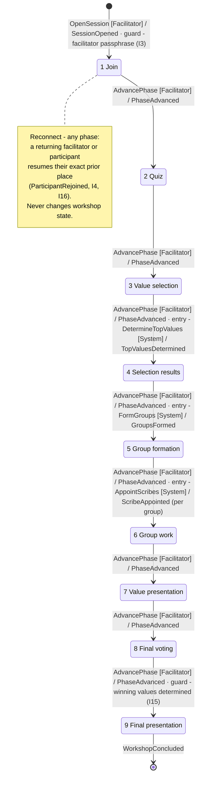
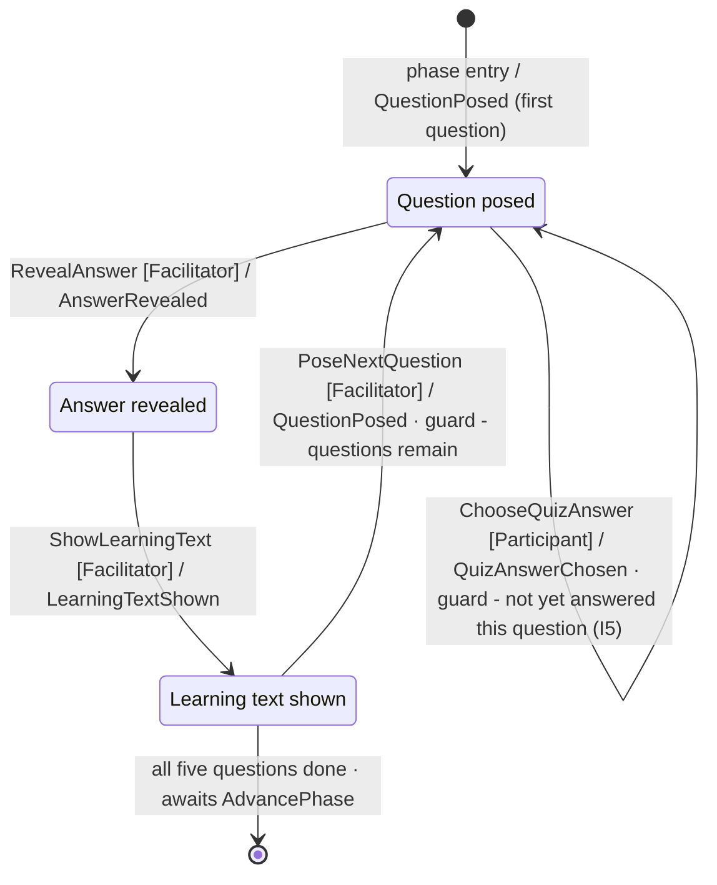
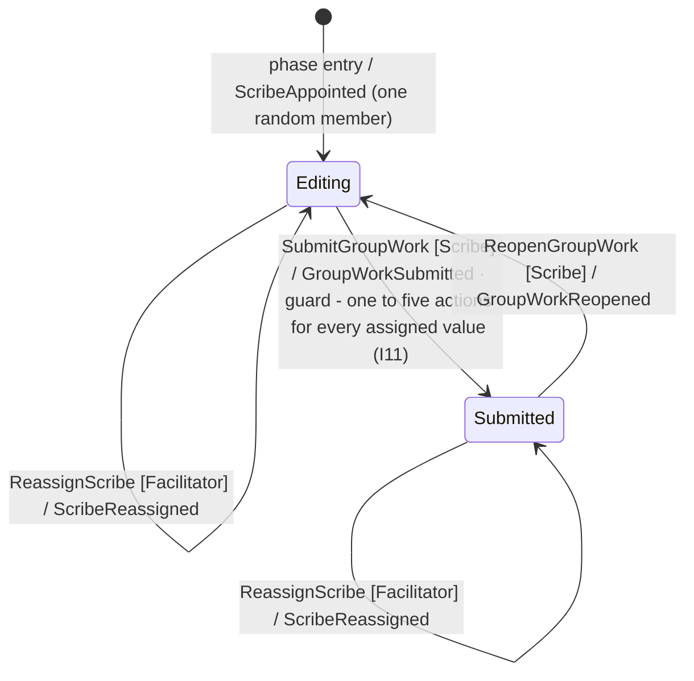
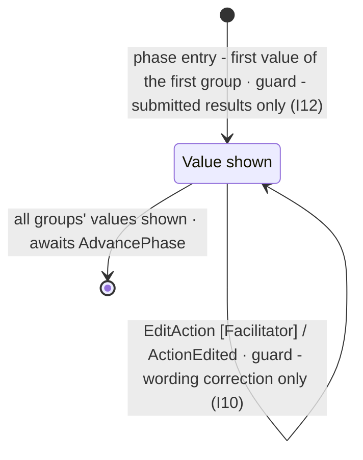
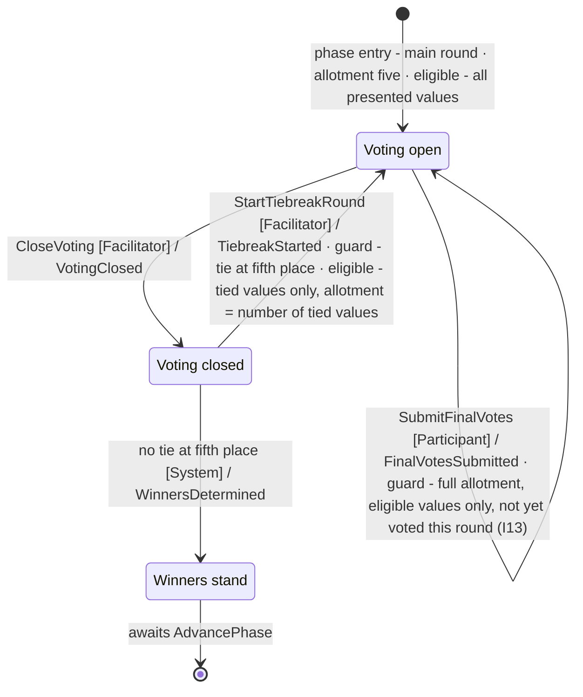
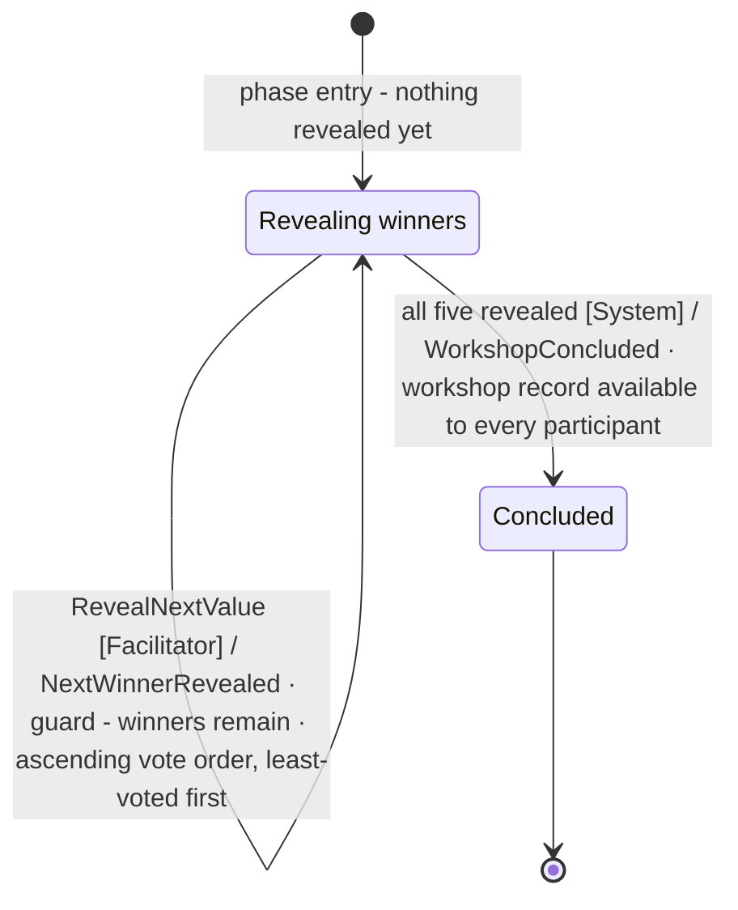

# Phase State Machine — ValuesWorkshop

Living document. Domain level only — expressed entirely in the ubiquitous
language of `design/domain-model.md`; commands, events, and invariants are
consumed from there verbatim. Deviations discovered during implementation
update this file (and, if terms change, the domain model) in the same PR
(Ask-first).

Transition label convention: `Command [Actor] / Event`, guards in prose.
**System** transitions fire when the session itself acts on phase entry or
when a condition is met — no person issues them.

---

## 1. Top-level: the nine phases

Forward-only (I1); only the facilitator advances (I2). Every
`AdvancePhase` emits `PhaseAdvanced`. Entering phases 4, 5, and 6 triggers
a System command before anything else happens in that phase.

Session-wide commands, allowed in any phase:

| Command | Actor | Guard | Event |
|---|---|---|---|
| JoinSession | Participant | phase is Join (see §2.1) | ParticipantJoined |
| (return after interruption) | Facilitator / Participant | already on the roster (I4) | ParticipantRejoined |
| AdvancePhase | Facilitator | forward only; next phase's entry guard holds | PhaseAdvanced |

There is no backward transition anywhere in this document — by design (I1).

---

## 2. Per-phase sub-states

### 2.1 Phase 1 — Join

No sub-states. The roster grows; joiners wait in the lobby.

| Command | Actor | Guard | Event |
|---|---|---|---|
| JoinSession | Participant | not already on the roster (returning people rejoin instead, I4) | ParticipantJoined |

Leaving Join: `AdvancePhase` — no guard beyond I2 (the facilitator decides
when enough participants have joined).

### 2.2 Phase 2 — Quiz

Five quiz questions, posed one at a time, in order. Per question the
sub-state walks strictly forward: answering → revealed → learning text.

Guards in words:

- **ChooseQuizAnswer** — refused if this participant already answered the
  current question (I5); the answer tally grows, never who-picked-what.
- **PoseNextQuestion** — refused while the current question is unrevealed
  or its learning text unshown (the walk is forward-only within a
  question), and refused when no questions remain.
- **AdvancePhase** out of Quiz — allowed once the last question's learning
  text has been shown.

### 2.3 Phase 3 — Value selection

No sub-states. Each participant submits exactly once.

| Command | Actor | Guard | Event |
|---|---|---|---|
| SubmitValueSelection | Participant | exactly ten distinct catalog values; not yet submitted (I6) | ValuesSelected |

Leaving Value selection: `AdvancePhase` — the facilitator decides; the
selection tally's submission progress informs them. Participants who never
submit simply contribute nothing to the tally.

### 2.4 Phase 4 — Selection results

On entry: `DetermineTopValues [System] / TopValuesDetermined` — the top
values are fixed from the selection tally, widened on a tenth-place tie
(I7). No further sub-states; the phase displays the tally until
`AdvancePhase`.

### 2.5 Phase 5 — Group formation

On entry: `FormGroups [System] / GroupsFormed` — participants partitioned
and top values dealt out per the sizing rule and the formation aim; fixed
from then on (I8). No further sub-states; groups and assignments are shown
until `AdvancePhase`.

### 2.6 Phase 6 — Group work

On entry: `AppointScribes [System] / ScribeAppointed` per group (I9). Each
group then runs its **own, independent** sub-state machine — one group's
edits never contend with another's (Group aggregate):

Guards in words:

- **AddAction / EditAction / RemoveAction** — scribe of that group only
  (I10); refused while Submitted (I11); AddAction refused beyond five
  actions on a value.
- **SubmitGroupWork** — refused unless every assigned value carries one to
  five actions (I11).
- **ReassignScribe** — facilitator only, any time, target must be a member
  of that group (I9); the previous scribe's rights end immediately (I10).
- **AdvancePhase** out of Group work — guard: every group is Submitted
  (only submitted results can be presented, I12).

### 2.7 Phase 7 — Value presentation

The facilitator steps value by value through each group's submitted
result; when a group's assigned values are exhausted, the walk moves to
the next group's first value (I12).

Guards in words:

- **GoToNextValue** — refused when every group's every value has been
  shown (nothing left to present).
- **EditAction** — facilitator only in this phase; corrects the wording of
  a presented action (e.g. typos); adding or removing actions is refused
  (I10). (Actor extension decided in the Task 0.3 screen-flow review.)
- **AdvancePhase** out of Value presentation — allowed once all values
  have been shown.

### 2.8 Phase 8 — Final voting

A main round (allotment: five votes) and, while a fifth-place tie
persists, tiebreak rounds (allotment: number of tied values, eligible:
tied values only), repeated until exactly five winning values stand (I15).

Guards in words:

- **SubmitFinalVotes** — refused on wrong totals, votes outside the
  round's eligible values, or a second submission in the same round (I13).
  Votes are anonymous and secret; no un-voting exists (I14).
- **CloseVoting** — facilitator only; ends the current round. If no
  fifth-place tie remains, `WinnersDetermined` follows immediately
  (System, condition met).
- **StartTiebreakRound** — refused unless the last closed round left a
  fifth-place tie (I15).
- **AdvancePhase** out of Final voting — guard: winners stand (exactly
  five winning values, I15).

### 2.9 Phase 9 — Final presentation

Winners revealed one by one in ascending vote order — least-voted winner
first, most-voted last.

Guards in words:

- **RevealNextValue** — refused once all five winners are revealed.
- After the fifth reveal, `WorkshopConcluded` (System, condition met): the
  workshop record becomes available. The session is complete; there is no
  further phase.

---

## 3. Transition table (complete)

Every transition in this document, with actor and guard. SPEC.md
facilitator sub-controls are marked ◆.

| # | Phase | Transition | Actor | Guard | Event |
|---|---|---|---|---|---|
| T1 | — | Open session | Facilitator | facilitator passphrase (I3) | SessionOpened |
| T2 | any | Advance phase ◆ | Facilitator | forward only (I1); phase-exit guards T2a–T2c | PhaseAdvanced |
| T2a | 6→7 | — exit guard | — | every group Submitted (I12) | — |
| T2b | 8→9 | — exit guard | — | winners stand (I15) | — |
| T2c | 2→3, 7→8 | — exit guard | — | walk complete (all questions / all values shown) | — |
| T3 | any | Return after interruption | Facilitator / Participant | on the roster (I4) | ParticipantRejoined |
| T4 | 1 | Join | Participant | not already on the roster (I4) | ParticipantJoined |
| T5 | 2 | Choose quiz answer | Participant | not yet answered this question (I5) | QuizAnswerChosen |
| T6 | 2 | Reveal answer ◆ | Facilitator | current question unrevealed | AnswerRevealed |
| T7 | 2 | Show learning text ◆ | Facilitator | answer revealed, text unshown | LearningTextShown |
| T8 | 2 | Pose next question ◆ | Facilitator | learning text shown; questions remain | QuestionPosed |
| T9 | 3 | Submit value selection | Participant | exactly ten distinct; not yet submitted (I6) | ValuesSelected |
| T10 | →4 | Determine top values | System | on phase entry; widen on tenth-place tie (I7) | TopValuesDetermined |
| T11 | →5 | Form groups | System | on phase entry; sizing rule + formation aim (I8) | GroupsFormed |
| T12 | →6 | Appoint scribes | System | on phase entry; one random member per group (I9) | ScribeAppointed |
| T13 | 6 | Reassign scribe ◆ | Facilitator | target is a group member (I9) | ScribeReassigned |
| T14 | 6 | Add / edit / remove action | Scribe | own group; Editing; ≤ five per value (I10, I11) | ActionAdded / ActionEdited / ActionRemoved |
| T15 | 6 | Submit group work | Scribe | one to five actions per assigned value (I11) | GroupWorkSubmitted |
| T16 | 6 | Reopen group work | Scribe | currently Submitted | GroupWorkReopened |
| T17 | 7 | Go to next value ◆ | Facilitator | values remain to show (I12) | NextValueShown |
| T17a | 7 | Edit action (typo fix) | Facilitator | wording correction of a presented action only (I10) | ActionEdited |
| T18 | 8 | Submit final votes | Participant | full allotment; eligible values; once per round (I13, I14) | FinalVotesSubmitted |
| T19 | 8 | Close voting ◆ | Facilitator | round open | VotingClosed |
| T20 | 8 | Winners determined | System | round closed; no fifth-place tie (I15) | WinnersDetermined |
| T21 | 8 | Start tiebreak round ◆ | Facilitator | fifth-place tie after closed round (I15) | TiebreakStarted |
| T22 | 9 | Reveal next value ◆ | Facilitator | winners remain; ascending vote order | NextWinnerRevealed |
| T23 | 9 | Workshop concluded | System | all five winners revealed | WorkshopConcluded |

SPEC.md facilitator sub-control coverage: next question (T8), reveal (T6),
learning text (T7), presenting group / next value (T17), close voting
(T19), tiebreak (T21), scribe reassignment (T13), winner reveal (T22),
phase advance (T2) — all present. ◆ count: 9.

## 4. Walk-through check (SPEC.md, no dead ends)

Each phase has at least one exit and every exit guard is satisfiable:

1. **Join** → advance any time (facilitator judgment).
2. **Quiz** → five questions, each walk forward-completable → advance.
3. **Value selection** → submissions optional for exit; advance any time.
4. **Selection results** → entry command always succeeds (tally may widen
   the set); advance any time.
5. **Group formation** → sizing rule guarantees ≥ 1 group; advance any time.
6. **Group work** → every group can reach Submitted (scribe reassignment
   rescues a dead phone); exit guard satisfiable.
7. **Value presentation** → finite values, walk terminates; advance.
8. **Final voting** → every closed round either yields winners or permits
   a tiebreak; tied set shrinks or resolves — no infinite mandatory loop
   blocks exit (facilitator repeats tiebreaks until five survive, I15).
9. **Final presentation** → five reveals, then concluded. End state.

No transition lacks an actor and guard (see §3). All commands and events
of `domain-model.md` §2–§3 appear; none were invented here.
