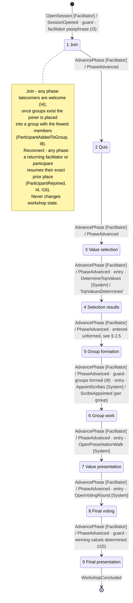
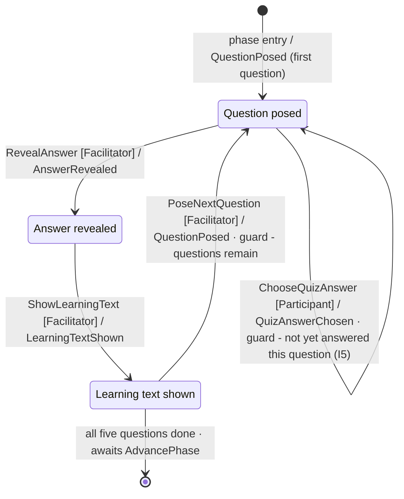
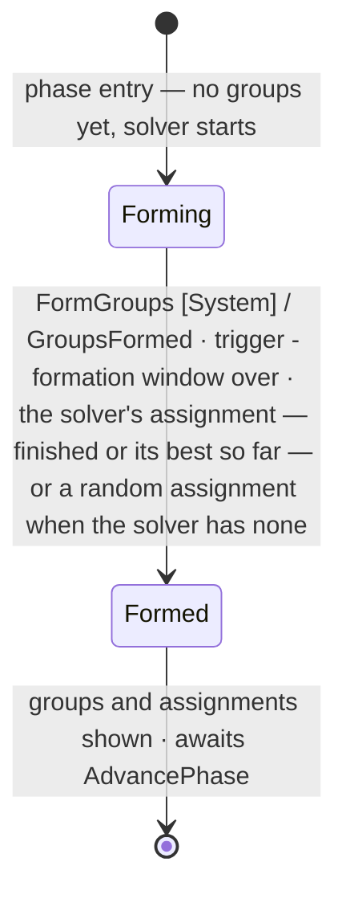
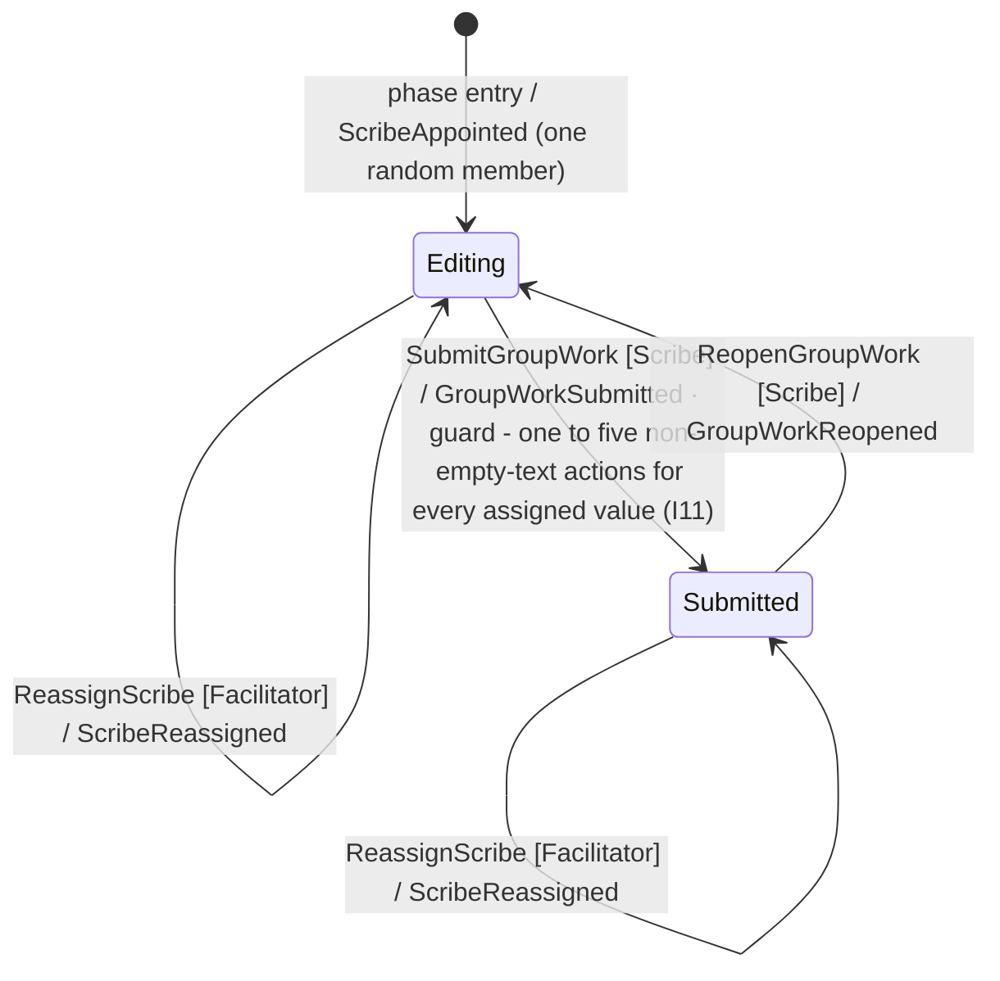
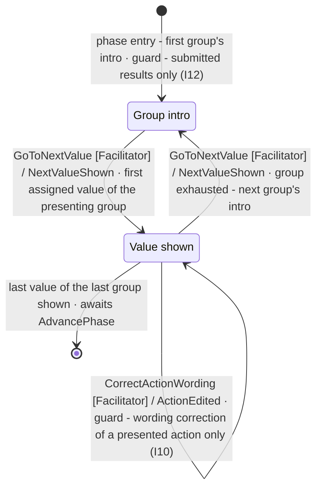
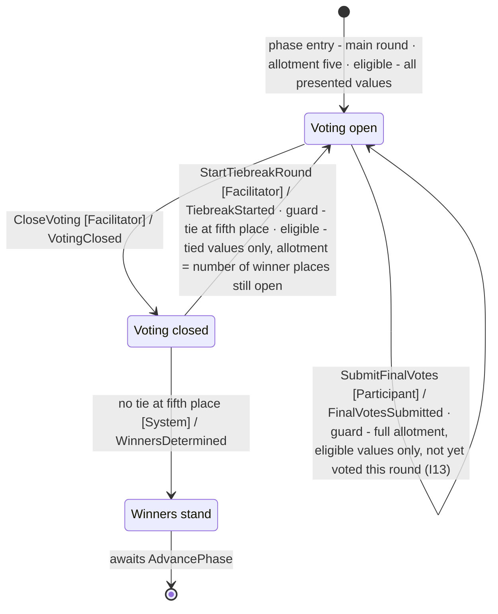
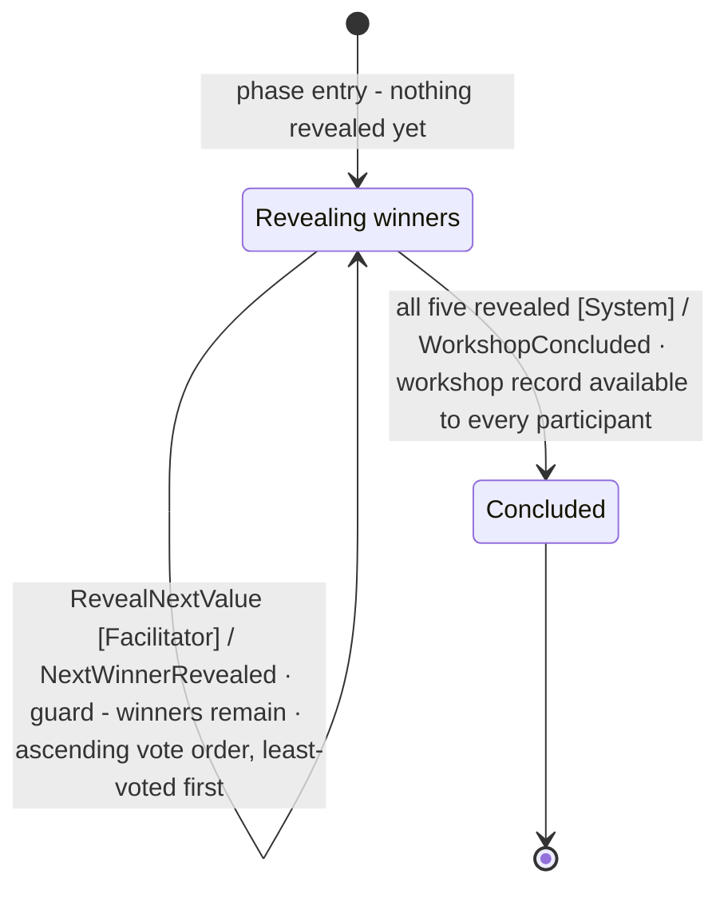

# Phase State Machine — ValuesWorkshop

Living document. Domain level only — expressed entirely in the ubiquitous
language of `design/domain-model.md`; commands, events, and invariants are
consumed from there verbatim. Deviations discovered during implementation
update this file (and, if terms change, the domain model) in the same PR
(Ask-first).

Transition label convention: `Command [Actor] / Event`, guards in prose.
**System** transitions fire when the session itself acts on phase entry or
when a condition is met — no person issues them.

---

## 1. Top-level: the nine phases

Forward-only (I1); only the facilitator advances (I2). Every
`AdvancePhase` emits `PhaseAdvanced`. Entering phases 4, 6, 7, and 8
triggers a System command before anything else happens in that phase.
Phase 5 is the exception: it is entered unformed and its System command
fires later, on the server clock (§ 2.5).

```mermaid
stateDiagram-v2
    state "1 Join" as P1
    state "2 Quiz" as P2
    state "3 Value selection" as P3
    state "4 Selection results" as P4
    state "5 Group formation" as P5
    state "6 Group work" as P6
    state "7 Value presentation" as P7
    state "8 Final voting" as P8
    state "9 Final presentation" as P9

    [*] --> P1 : OpenSession [Facilitator] / SessionOpened · guard - facilitator passphrase (I3)
    P1 --> P2 : AdvancePhase [Facilitator] / PhaseAdvanced
    P2 --> P3 : AdvancePhase [Facilitator] / PhaseAdvanced
    P3 --> P4 : AdvancePhase [Facilitator] / PhaseAdvanced · entry - DetermineTopValues [System] / TopValuesDetermined
    P4 --> P5 : AdvancePhase [Facilitator] / PhaseAdvanced · entered unformed, see § 2.5
    P5 --> P6 : AdvancePhase [Facilitator] / PhaseAdvanced · guard - groups formed (I8) · entry - AppointScribes [System] / ScribeAppointed (per group)
    P6 --> P7 : AdvancePhase [Facilitator] / PhaseAdvanced · entry - OpenPresentationWalk [System]
    P7 --> P8 : AdvancePhase [Facilitator] / PhaseAdvanced · entry - OpenVotingRound [System]
    P8 --> P9 : AdvancePhase [Facilitator] / PhaseAdvanced · guard - winning values determined (I15)
    P9 --> [*] : WorkshopConcluded

    note right of P1
      Join - any phase:
      latecomers are welcome (I4);
      once groups exist the joiner is placed
      into a group with the fewest members
      (ParticipantAddedToGroup, I8).

      Reconnect - any phase:
      a returning facilitator or participant
      resumes their exact prior place
      (ParticipantRejoined, I4, I16).
      Never changes workshop state.
    end note
```

Session-wide commands, allowed in any phase:

| Command | Actor | Guard | Event |
|---|---|---|---|
| JoinSession | Participant | not already on the roster (I4) — allowed in every phase; once groups exist it also places the joiner into a group (see § 2.5) | ParticipantJoined |
| (return after interruption) | Facilitator / Participant | already on the roster (I4) | ParticipantRejoined |
| AdvancePhase | Facilitator | forward only; next phase's entry guard holds | PhaseAdvanced |

There is no backward transition anywhere in this document — by design (I1).

---

## 2. Per-phase sub-states

### 2.1 Phase 1 — Join

No sub-states. The roster grows; joiners wait in the lobby. Joining is not
confined to this phase — it is a session-wide command (§ 1); this is only the
phase whose entire purpose is waiting for it.

| Command | Actor | Guard | Event |
|---|---|---|---|
| JoinSession | Participant | not already on the roster (returning people rejoin instead, I4) | ParticipantJoined |

Leaving Join: `AdvancePhase` — no guard beyond I2 (the facilitator decides
when enough participants have joined).

### 2.2 Phase 2 — Quiz

Five quiz questions, posed one at a time, in order. Per question the
sub-state walks strictly forward: answering → revealed → learning text.

```mermaid
stateDiagram-v2
    state "Question posed" as Answering
    state "Answer revealed" as Revealed
    state "Learning text shown" as Learning

    [*] --> Answering : phase entry / QuestionPosed (first question)
    Answering --> Answering : ChooseQuizAnswer [Participant] / QuizAnswerChosen · guard - not yet answered this question (I5)
    Answering --> Revealed : RevealAnswer [Facilitator] / AnswerRevealed
    Revealed --> Learning : ShowLearningText [Facilitator] / LearningTextShown
    Learning --> Answering : PoseNextQuestion [Facilitator] / QuestionPosed · guard - questions remain
    Learning --> [*] : all five questions done · awaits AdvancePhase
```

Guards in words:

- **ChooseQuizAnswer** — refused if this participant already answered the
  current question (I5); the answer tally grows, never who-picked-what.
- **PoseNextQuestion** — refused while the current question is unrevealed
  or its learning text unshown (the walk is forward-only within a
  question), and refused when no questions remain.
- **AdvancePhase** out of Quiz — allowed once the last question's learning
  text has been shown.

### 2.3 Phase 3 — Value selection

No sub-states. Each participant submits exactly once.

| Command | Actor | Guard | Event |
|---|---|---|---|
| SubmitValueSelection | Participant | exactly ten distinct catalog values; not yet submitted (I6) | ValuesSelected |

Leaving Value selection: `AdvancePhase` — the facilitator decides; the
selection tally's submission progress informs them. Participants who never
submit simply contribute nothing to the tally.

### 2.4 Phase 4 — Selection results

On entry: `DetermineTopValues [System] / TopValuesDetermined` — the top
values are fixed from the selection tally, widened on a tenth-place tie
(I7). No further sub-states; the phase displays the tally until
`AdvancePhase`.

### 2.5 Phase 5 — Group formation

The phase is entered **unformed** and walks one sub-state forward. Forming
the groups is not an entry action: the session sits in `Forming` for a fixed
window (3 seconds, Task 19b) while the solver works, and the formation is
applied when that window is over.

```mermaid
stateDiagram-v2
    state "Forming" as Forming
    state "Formed" as Formed

    [*] --> Forming : phase entry — no groups yet, solver starts
    Forming --> Formed : FormGroups [System] / GroupsFormed · trigger - formation window over · the solver's assignment — finished or its best so far — or a random assignment when the solver has none
    Formed --> [*] : groups and assignments shown · awaits AdvancePhase
```

Guards in words:

- **FormGroups** — participants partitioned and top values dealt out per the
  sizing rule and the formation aim; the value-to-group assignment is fixed
  from then on (I8). It fires once, on the server clock, never on a person's
  command; a solver still searching hands over its best assignment so far,
  and a random assignment stands in when it has none, so the window always
  ends formed.
- **AdvancePhase** out of Group formation — refused while `Forming`: only
  formed groups can be worked in (I8). The advance itself stays
  facilitator-triggered.

While `Forming` no group data exists, so none is shown or sent
(`design/protocol.md` § 5.1); the elapsed fraction of the window is emitted
instead, and the presenter and participant screens render their progress bar
from it. The run is memory-only, and the formation ticker is what looks for
one: every 250 ms it loads each session a client is connected to that has no
run, and a session it finds unformed in phase 5 gets one. A server restarting
mid-window therefore starts a fresh window within a quarter second of the
first client reconnecting, while a session that was already formed simply
keeps its groups. A run whose room has emptied is dropped, and the next
connection starts it over.

Once formed, `JoinSession` carries a second effect:
`AddParticipantToGroup [System] / ParticipantAddedToGroup` puts the joiner
into a group with the fewest members (ties random). Sizes therefore stay
within one of each other, no top value is re-dealt, and the joiner is never
that group's scribe — scribes are appointed once, on entry to phase 6 (I9),
and a group that has already submitted stays submitted. A participant who
joins while `Forming` has no group to be added to yet; `FormGroups` places
them with everyone else on the roster when the window closes.

### 2.6 Phase 6 — Group work

On entry: `AppointScribes [System] / ScribeAppointed` per group (I9). Each
group then runs its **own, independent** sub-state machine — one group's
edits never contend with another's (Group aggregate):

```mermaid
stateDiagram-v2
    state "Editing" as Editing
    state "Submitted" as Submitted

    [*] --> Editing : phase entry / ScribeAppointed (one random member)
    Editing --> Editing : AddAction, EditAction, RemoveAction [Scribe] / ActionAdded, ActionEdited, ActionRemoved · guard - at most five per assigned value (I11)
    Editing --> Submitted : SubmitGroupWork [Scribe] / GroupWorkSubmitted · guard - one to five non-empty-text actions for every assigned value (I11)
    Submitted --> Editing : ReopenGroupWork [Scribe] / GroupWorkReopened
    Editing --> Editing : ReassignScribe [Facilitator] / ScribeReassigned
    Submitted --> Submitted : ReassignScribe [Facilitator] / ScribeReassigned
```

Guards in words:

- **AddAction / EditAction / RemoveAction** — scribe of that group only
  (I10); refused while Submitted (I11); AddAction refused beyond five
  actions on a value.
- **SubmitGroupWork** — refused unless every assigned value carries one to
  five actions with non-empty text (I11).
- **ReassignScribe** — facilitator only, during group work only, target must
  be a member of that group (I9); the previous scribe's rights end
  immediately (I10).
- **AdvancePhase** out of Group work — guard: every group is Submitted
  (only submitted results can be presented, I12).

### 2.7 Phase 7 — Value presentation

The walk runs in per-group blocks (formation order, I12): each group's
block opens with a group intro position ("up next: Group Otter"),
followed by one position per assigned value (stored sort order) — the
value plus its submitted actions. The facilitator is the clock; the walk
advances by command only.

```mermaid
stateDiagram-v2
    state "Group intro" as Intro
    state "Value shown" as Shown

    [*] --> Intro : phase entry - first group's intro · guard - submitted results only (I12)
    Intro --> Shown : GoToNextValue [Facilitator] / NextValueShown · first assigned value of the presenting group
    Shown --> Shown : GoToNextValue [Facilitator] / NextValueShown · next assigned value of the presenting group
    Shown --> Intro : GoToNextValue [Facilitator] / NextValueShown · group exhausted - next group's intro
    Shown --> Shown : CorrectActionWording [Facilitator] / ActionEdited · guard - wording correction of a presented action only (I10)
    Shown --> [*] : last value of the last group shown · awaits AdvancePhase
```

Guards in words:

- **Phase entry** stands the walk on the first group's intro via a phase
  entry action (like scribe appointment on phase 6).
- **GoToNextValue** — refused on the last value of the last group
  (nothing left to present).
- **CorrectActionWording** — facilitator only in this phase; reuses the
  domain edit path scoped to the currently presented value's actions;
  the corrected text stays non-empty (a submitted group keeps one to
  five non-empty actions); refused on a group intro; adding or removing
  actions is refused (I10). (Actor extension decided in the Task 0.3
  screen-flow review.)
- **AdvancePhase** out of Value presentation — guarded by the
  `ValuePresentationExitGuard` registered in `PhaseExitGuards`:
  satisfied once the shown-value count equals the session's total
  assigned values (sum over the groups — derived per session, no
  hardcoded constant).

### 2.8 Phase 8 — Final voting

A main round (allotment: five votes) and, while a fifth-place tie
persists, tiebreak rounds (allotment: number of winner places still
open, eligible: tied values only), repeated until exactly five winning
values stand (I15).

```mermaid
stateDiagram-v2
    state "Voting open" as Open
    state "Voting closed" as Closed
    state "Winners stand" as Winners

    [*] --> Open : phase entry - main round · allotment five · eligible - all presented values
    Open --> Open : SubmitFinalVotes [Participant] / FinalVotesSubmitted · guard - full allotment, eligible values only, not yet voted this round (I13)
    Open --> Closed : CloseVoting [Facilitator] / VotingClosed
    Closed --> Winners : no tie at fifth place [System] / WinnersDetermined
    Closed --> Open : StartTiebreakRound [Facilitator] / TiebreakStarted · guard - tie at fifth place · eligible - tied values only, allotment = number of winner places still open
    Winners --> [*] : awaits AdvancePhase
```

Guards in words:

- **Phase entry** opens the main round via a phase entry action
  (`VotingOpening`, like scribe appointment on phase 6): allotment five,
  eligible all values the groups presented.
- **SubmitFinalVotes** — refused on wrong totals, votes outside the
  round's eligible values, or a second submission in the same round (I13).
  Votes are anonymous and secret; no un-voting exists (I14).
- **CloseVoting** — facilitator only; ends the current round. If no
  fifth-place tie remains, `WinnersDetermined` follows immediately
  (System, condition met).
- **StartTiebreakRound** — refused unless the last closed round left a
  fifth-place tie (I15).
- **AdvancePhase** out of Final voting — guard: winners stand (exactly
  five winning values, I15).

### 2.9 Phase 9 — Final presentation

Winners revealed one by one in ascending vote order — least-voted winner
first, most-voted last.

```mermaid
stateDiagram-v2
    state "Revealing winners" as Revealing
    state "Concluded" as Done

    [*] --> Revealing : phase entry - nothing revealed yet
    Revealing --> Revealing : RevealNextValue [Facilitator] / NextWinnerRevealed · guard - winners remain · ascending vote order, least-voted first
    Revealing --> Done : all five revealed [System] / WorkshopConcluded · workshop record available to every participant
    Done --> [*]
```

Guards in words:

- **RevealNextValue** — refused once all five winners are revealed.
- After the fifth reveal, `WorkshopConcluded` (System, condition met): the
  workshop record becomes available. The session is complete; there is no
  further phase.

---

## 3. Transition table (complete)

Every transition in this document, with actor and guard. SPEC.md
facilitator sub-controls are marked ◆.

| # | Phase | Transition | Actor | Guard | Event |
|---|---|---|---|---|---|
| T1 | — | Open session | Facilitator | facilitator passphrase (I3) | SessionOpened |
| T2 | any | Advance phase ◆ | Facilitator | forward only (I1); phase-exit guards T2a–T2d | PhaseAdvanced |
| T2a | 6→7 | — exit guard | — | every group Submitted (I12) | — |
| T2b | 8→9 | — exit guard | — | winners stand (I15) | — |
| T2c | 2→3, 7→8 | — exit guard | — | walk complete (all questions / all values shown) | — |
| T2d | 5→6 | — exit guard | — | groups formed (I8) | — |
| T3 | any | Return after interruption | Facilitator / Participant | on the roster (I4) | ParticipantRejoined |
| T4 | any | Join | Participant | not already on the roster (I4) | ParticipantJoined |
| T4a | 5–9 | — joiner placed into a group | System | groups exist; group with the fewest members, ties random (I8) | ParticipantAddedToGroup |
| T5 | 2 | Choose quiz answer | Participant | not yet answered this question (I5) | QuizAnswerChosen |
| T6 | 2 | Reveal answer ◆ | Facilitator | a question is posed (repeat is a no-op) | AnswerRevealed |
| T7 | 2 | Show learning text ◆ | Facilitator | answer revealed (repeat is a no-op) | LearningTextShown |
| T8 | 2 | Pose next question ◆ | Facilitator | learning text shown; questions remain | QuestionPosed |
| T9 | 3 | Submit value selection | Participant | exactly ten distinct; not yet submitted (I6) | ValuesSelected |
| T10 | →4 | Determine top values | System | on phase entry; widen on tenth-place tie (I7) | TopValuesDetermined |
| T11 | 5 | Form groups | System | formation window over; sizing rule + formation aim (I8); the solver's best assignment so far when it did not finish, random when it has none | GroupsFormed |
| T12 | →6 | Appoint scribes | System | on phase entry; one random member per group (I9) | ScribeAppointed |
| T12a | →7 | Open presentation walk | System | on phase entry; first group's intro (I12) | NextValueShown |
| T12b | →8 | Open voting round | System | on phase entry; allotment five, eligible = all presented values | — |
| T13 | 6 | Reassign scribe ◆ | Facilitator | target is a group member (I9) | ScribeReassigned |
| T14 | 6 | Add / edit / remove action | Scribe | own group; Editing; ≤ five per value (I10, I11) | ActionAdded / ActionEdited / ActionRemoved |
| T15 | 6 | Submit group work | Scribe | one to five non-empty-text actions per assigned value (I11) | GroupWorkSubmitted |
| T16 | 6 | Reopen group work | Scribe | currently Submitted | GroupWorkReopened |
| T17 | 7 | Go to next value ◆ | Facilitator | a next position remains — group intro or value (I12) | NextValueShown |
| T17a | 7 | Correct action wording (typo fix) | Facilitator | wording correction of a presented action only; refused on a group intro (I10) | ActionEdited |
| T18 | 8 | Submit final votes | Participant | full allotment; eligible values; once per round (I13, I14) | FinalVotesSubmitted |
| T19 | 8 | Close voting ◆ | Facilitator | round open | VotingClosed |
| T20 | 8 | Winners determined | System | round closed; no fifth-place tie (I15) | WinnersDetermined |
| T21 | 8 | Start tiebreak round ◆ | Facilitator | fifth-place tie after closed round (I15) | TiebreakStarted |
| T22 | 9 | Reveal next value ◆ | Facilitator | winners remain; ascending vote order | NextWinnerRevealed |
| T23 | 9 | Workshop concluded | System | all five winners revealed | WorkshopConcluded |

SPEC.md facilitator sub-control coverage: next question (T8), reveal (T6),
learning text (T7), presenting group / next value (T17), close voting
(T19), tiebreak (T21), scribe reassignment (T13), winner reveal (T22),
phase advance (T2) — all present. ◆ count: 9.

## 4. Walk-through check (SPEC.md, no dead ends)

Each phase has at least one exit and every exit guard is satisfiable:

1. **Join** → advance any time (facilitator judgment).
2. **Quiz** → five questions, each walk forward-completable → advance.
3. **Value selection** → submissions optional for exit; advance any time.
4. **Selection results** → entry command always succeeds (tally may widen
   the set); advance any time.
5. **Group formation** → the window always ends and always yields ≥ 1 group
   (solver assignment or random fallback); exit guard satisfiable.
6. **Group work** → every group can reach Submitted (scribe reassignment
   rescues a dead phone); exit guard satisfiable.
7. **Value presentation** → finite positions (group intros + values),
   walk terminates; advance.
8. **Final voting** → every closed round either yields winners or permits
   a tiebreak; tied set shrinks or resolves — no infinite mandatory loop
   blocks exit (facilitator repeats tiebreaks until five survive, I15).
9. **Final presentation** → five reveals, then concluded. End state.

No transition lacks an actor and guard (see §3). All commands and events
of `domain-model.md` §2–§3 appear; none were invented here.
